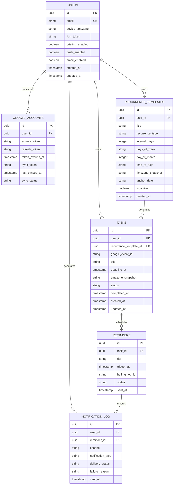

```mermaid

erDiagram
    USERS ||--o{ GOOGLE_ACCOUNTS : "syncs with"
    USERS ||--o{ RECURRENCE_TEMPLATES : "owns"
    USERS ||--o{ TASKS : "owns"
    USERS ||--o{ NOTIFICATION_LOG : "generates"
    RECURRENCE_TEMPLATES ||--o{ TASKS : "generates"
    TASKS ||--o{ REMINDERS : "schedules"
    REMINDERS ||--o{ NOTIFICATION_LOG : "records"

    USERS {
        uuid id PK
        string email UK
        string device_timezone
        string fcm_token
        boolean briefing_enabled
        boolean push_enabled
        boolean email_enabled
        timestamp created_at
        timestamp updated_at
    }

    GOOGLE_ACCOUNTS {
        uuid id PK
        uuid user_id FK
        string access_token
        string refresh_token
        timestamp token_expires_at
        string sync_token
        timestamp last_synced_at
        string sync_status
    }

    RECURRENCE_TEMPLATES {
        uuid id PK
        uuid user_id FK
        string title
        string recurrence_type
        integer interval_days
        string days_of_week
        integer day_of_month
        string time_of_day
        string timezone_snapshot
        string anchor_date
        boolean is_active
        timestamp created_at
    }

    TASKS {
        uuid id PK
        uuid user_id FK
        uuid recurrence_template_id FK
        string google_event_id
        string title
        timestamp deadline_at
        string timezone_snapshot
        string status
        timestamp completed_at
        timestamp created_at
        timestamp updated_at
    }

    REMINDERS {
        uuid id PK
        uuid task_id FK
        string tier
        timestamp trigger_at
        string bullmq_job_id
        string status
        timestamp sent_at
    }

    NOTIFICATION_LOG {
        uuid id PK
        uuid user_id FK
        uuid reminder_id FK
        string channel
        string notification_type
        string delivery_status
        string failure_reason
        timestamp sent_at
    }

```